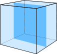

# Usage
Call `main.py` with the Cubic Post Code

```
usage: main.py [-h] CubicCode

positional arguments:
  CubicCode   The Cubic Code that will be converted

optional arguments:
  -h, --help  show this help message and exit
```

# Process
This is based on my understanding of the cube numbers as presented by [CubicPostcode.com](CubicPostcode.com).

## X-Layers

The layers in the X-axis will start at +0.5 and alternate from left to right there after. Each layer will have 441 000 000 000 000 000 cubes in it.

```
21 000 000 * 21 000 000 = 441 000 000 000 000
```
Thus the first (middle) layer has cubes numbered 1 to 441 000 000 000 000. The second layer, being the one to the left of the middle layer, has cubes 441 000 000 000 001 to 882 000 000 000 000. The third layer, being to the right of the middle layer, will start at 882 000 0000 001 and have its 441 000 000 000 000 cubes. Thus each layer can be thought of as having a base number.

## Base number
The base number for each x-axis layer is the cube the previous layer ended on. The base number can be calculated as follow:
```
base(n) = 411 000 000 000 000(n - 1)
```

Where `n` is the x-layer number. `n` goes from 0 to 21 000 000.

So for the first and second layer the base number is as follow:
```
base(1) = 441 000 000 000 000(0)
        = 0

base(2) = 441 000 000 000 000(1)
        = 441 000 000 000 000
```

This conforms to the observation made earlier. Each cube will then be located at some offset from the layer's base number.

## Offset number
The offset numbers follow the same pattern for each x-layer. [CubicPostcode.com](CubicPostcode.com) presents the offsets as follow:


Calculating a cube number from the offset number is also easy:
```
Cube Number = base(n) + c
```
Where `n` is x-layer number for the cube as defined earlier and `c` is the offset number. `c` goes from 1 to 441 000 000 000 000.

Combining these gives
```
Cube Number = 441 000 000 000 000(n - 1) + c
```

From this it is easy to see that `c` can be thought of as a remainder and `(n - 1)` as a multiplicant.

## Finding the x-layer
This makes finding the x-layer easy. By solving `n` for the previous we get:

```
n = (Cube Number / 441 000 000 000 000) + 1 [- c]
```
Just a reminder: `c` is the remainder of the division.

So for cube number 5 we have:
```
n = (5 / 441 000 000 000 000 000 000) + 1
  = 0 + 1
  = 1
```

The remainder is 5. By the same token, for 3141592653-589793238462 we have:
```
n = (3 141 592 653 589 793 238 462 / 441 000 000 000 000) + 1
  = 7 123 792 + 1
  = 7 123 793
```

Its remainder is 381 589 793 238 462. These translate to the following code:
```python
def get_x_layer_and_offset(code: int) -> Tuple[int, int]:
    q, r = divmod(code, 441_000_000_000_000)
    return (q + 1, r)
```

Now the x-layer just needs to be converted to the x co-ordinate and the remainder to the z and y co-ordinates.

## X Co-ordinate
A side view of the x-layers has them numbered as follow:
<table>
<tr>
    <td>4</td>
    <td>2</td>
    <td>1</td>
    <td>3</td>
    <td>5</td>
</tr>
</table>

Here 1 is the middle x-layer. It is clear that all the layers to the right of the middle layer are odd numbers, while those to the left are even. They also need to map as follow:
<table>
<tr>
    <td>-1.5</td>
    <td>-0.5</td>
    <td>0.5</td>
    <td>1.5</td>
    <td>2.5</td>
</tr>
</table>

Combining these two:
1. All even layers need to divided by 2 and have 0.5 subtracted followed by a negation to find their x co-ordinate.
1. The odd layers just need to be divided by 2.

Thus the x co-ordinates are as follow:
```
x: [(n / 2) - 0.5] * -1 where n = 2k for k being an integer
   n / 2 where n = 2k + 1 for k being an integer
```

So we said 5 has an n = 1. Since it is odd, the second path has to follow:
```
x = 1 / 2
  = 0.5
```

Thus it is at x = 0.5. For 381 589 793 238 462 the calculated n = 7 123 793. This is also the second rule:
```
x = 7 123 793 - 1 / 2
  = 3 561 896.5
```

So its x co-ordinate is 3 561 896.5. This translates to the following code:
```python
def to_x_coordinate(layer: int) -> int:
    q, r = divmod(layer, 2)

    if r == 1:
        return q + 0.5

    return -(q - 0.5)
```

## Z and Y Co-ordinates
These co-ordinates come from the remainder when calculating the x-layer. Finding these will be easier once we know which square "radius" we are in.

### Square Radius


The blue outline is our square radius (r) and has a value of 2. The top blue row has co-ordinates (z, -2). The bottom row has co-ordinates (z, 2). The left (-2, y) and the right (2, y). Thus they all have the square radius in the co-ordinate at least once - the corners have it twice. Each side also has the length 2r.

The maximum offset in each square radius is as follow:
```
max = 2r ^ 2
```

These are marked in red. So the maximum offset for the marked square is as follow:
```
max = 2(2) ^ 2
    = 4 ^ 2
    = 16
```

The minimum is one more than the maximum for one radius smaller as follow:
```
min = 2(r - 1) ^ 2 + 1
```
For our current square it is clearly 5. But we need to work backwards.

### Finding Square Radius from Offset
This is done by solving `r` for min.
```
2(r - 1) = sqrt(c - 1)
r - 1 = sqrt(c - 1) / 2
r = [sqrt(c - 1) / 2] + 1
r = ceil[sqrt(c - 1) / 2]
```
Where `c` is the offset as defined earlier.

So offset 5 is in r:
```
r = ceil[sqrt(4) / 2]
  = ceil(1)
  = 2
```

Thus, the second square radius. For the offset 381 589 793 238 462 it is:
```
r = ceil[sqrt(381 589 793 238 462) / 2]
  = ceil[9 767 161.7325411121708508224392407]
  = 9 767 162
```
So our Pi is in the square radius 9 767 162. The code for these are as follow - with some changes for safety:

```python
def to_square_radius(offset: int) -> int:
    return math.ceil(math.sqrt(offset) / 2)

def to_min_offset(radius: int) -> int:
    return (2 * (radius - 1)) ** 2 + 1
```

From here it is simply a matter of walking around the square radius to find the side the cube is in. We already know the z or y co-ordinate will be the square radius and thus just need to solve the remaining one.

Looking back at the offset table, we know that the offset 12 is in the radius 2 with a minimum of 5. A radius 2 means the length of each side is 4 - we will subtract one from this to move to the next corner. So adding the side length (3) to the minimum (5) gives 8. Since 12 is not it this range it means that 12 is not in the top row. Add 3 again to the new minimum gives 11. This still less that 12, so it is not in the right side either. Adding another 3 gives 15. Since 12 is less than this, it has to be in the bottom row.

This results in the following code - adjustments are made to have the center of offset +1 at the origin:
```python
def to_z_y(offset: int) -> int:
    r = to_square_radius(offset)
    mini = to_min_offset(r)
    length = 2 * r - 1

    offset -= mini

    # In top row
    if offset < length:
        return (offset - r + 0.5, r - 0.5)

    offset -= length

    # In right row
    if offset < length:
        return (r - 0.5, -(offset - r) - 0.5)

    offset -= length

    # In bottom row
    if offset < length:
        return (-(offset - r) - 0.5, -r + 0.5)

    offset -= length

    # In left row
    return (-r + 0.5, offset - r + 0.5)
```

It results in the following z and y for the Pi number: -8 402 969.5, -9 767 161.5
